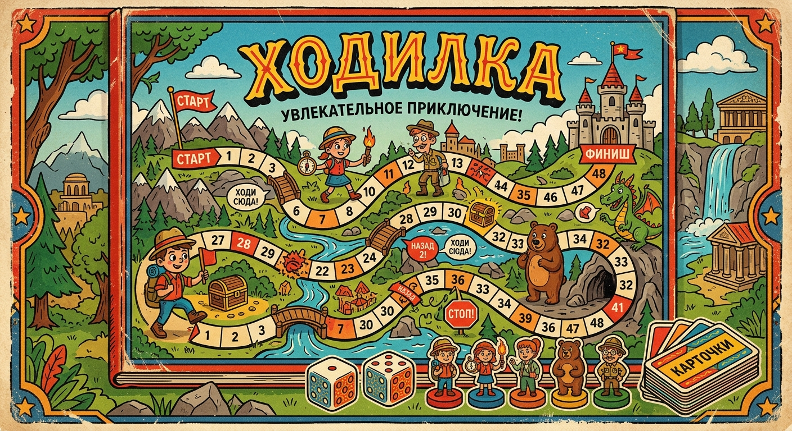

# 🎲 Ходилка MK2 — Современная настольная игра в вашем браузере

Интерактивная игра-ходилка, воссоздающая классическую бумажную настольную игру в качественном цифровом формате. Построена на стеке **React + TypeScript + Tailwind CSS** с поддержкой плавных анимаций перемещения фишек, до 13 игроков одновременно, функцией кастомизацией правил и интерактивной викториной.



---

## 🚀 Особенности и возможности игры

- **До 13 игроков**: Уникальные аватарки-мемы для каждого игрока с возможностью управлять именами и составом в любой момент игры.
- **Интерактивная карта на 90 клеток**: Фишки двигаются точно по сложным траекториям винтажного игрового поля (`f.jpg`) с плавными интерполированными анимациями движения.
- **Интерактивные Викторины**: Автоматическое распознавание попаданий на специальные клетки:
  - **БЛИЦ (Желтые клетки)**: Короткие задания на ловкость и сообразительность. Верный ответ — +1 шаг вперед!
  - **ВОПРОС (Красные клетки)**: Интеллектуальный вопрос. Верный ответ — +2 шага, неверный — откат на 1 шаг назад.
  - **ДУЭЛЬ (Синие клетки)**: Вызывайте соперника на дуэль! Победитель делает рывок вперед на 2 шага.
- **Анимированный кубик**: Реалистичный бросок кубика со случайно генерируемыми раундами вращения и точечным оформлением граней (как на настоящих физических кубиках).
- **Продвинутый блок управления**: Кнопки быстрой коррекции позиции фишек (+1, +2), ручной ввод шагов, пропуск хода, перемещение фишки вперед/назад на стрелках спец-эффектов.
- **Настройки параметров игры**:
  - Управление включением/выключением типов специальных клеток (Блиц, Вопрос, Дуэль).
  - Свободная перенастройка клеток для каждого из типов событий.
  - Настройка скорости анимации полета фишек по клеткам.
- **Адаптивный зум игрового поля**: Кнопки масштабирования карты и интеллектуальный переключатель "Вписать в экран" защищают от срезания краёв на экранах любого разрешения.
- **Умная память**: Полное сохранение текущего состояния игры (позиций игроков, порядка ходов, истории отвеченных вопросов) и настроек в `localStorage`. Игра не сотрется при случайном обновлении страницы!

---

## 📂 Структура проекта

```
├── README.md               # Руководство пользователя и инструкции
├── index.html              # HTML-оболочка приложения
├── vite.config.ts          # Конфигурация сборщика Vite
├── tailwind.config.ts      # Настройки Tailwind CSS стилей
├── package.json            # Скрипты запуска, сборки и внешние зависимости
├── public/                 # Статические файлы, доступные напрямую
│   ├── questions.json      # Заменяемая база вопросов для викторины
│   └── assets/
│       └── images/
│           ├── f.jpg       # Подложка винтажного игрового поля (карта)
│           └── 1-13.png    # Аватары игроков и мемы
└── src/                    # Исходный код приложения (TypeScript + React)
    ├── main.tsx            # Точка монтирования React-приложения
    ├── App.tsx             # Главный игровой модуль и интерфейсы управления
    ├── index.css           # Глобальные стили проекта с Tailwind
    ├── types.ts            # Описания строгих TypeScript-интерфейсов
    ├── coordinates.ts      # Массив 2D-координат для всех 90 игровых клеток
    ├── questionsData.ts    # Резервная встроенная база вопросов (если questions.json недоступен)
    └── components/         # Вспомогательные интерактивные модальные окна:
        ├── DiceModal.tsx        # Реалистичный кубик с физическим расположением точек
        ├── PlayersModal.tsx     # Удобная модалка добавления, настройки и выбора игроков
        ├── QuestionModal.tsx    # Карточка викторины с триггером переворота и выбором ответа
        ├── SettingsModal.tsx    # Конфигурация активных зон и скорости перемещения
        └── SpecialCellModal.tsx # Стрелочные переходы по событиям карты
```

---

## 🛠️ Локальный запуск и разработка

Приложение работает без необходимости настраивать сложные локальные базы данных или серверную часть.

### 1. Установка зависимостей
```bash
npm install
```

### 2. Запуск в режиме разработчика
```bash
npm run dev
```
После запуска откройте в браузере предоставленный адрес (обычно `http://localhost:3000`).

### 3. Сборка оптимизированной версии для продакшена
```bash
npm run build
```
Скомпилированные и оптимизированные файлы для развертывания будут сохранены в папке `/dist`.

---

## 🌐 Как запустить игру на GitHub Pages

Вы можете опубликовать вашу игру бесплатно на платформе GitHub Pages, чтобы играть с друзьями с любого устройства!

Есть два простых способа публикации:

### Сценарий А. Автоматическая сборка через GitHub Actions (Рекомендуется)

1. Создайте репозиторий на GitHub и отправьте в него код проекта.
2. Перейдите в репозитории во вкладку **Settings** -> **Pages**.
3. В разделе **Build and deployment** -> **Source** выберите **GitHub Actions**.
4. GitHub автоматически предложит готовый рабочий процесс для Vite проекта или вы можете использовать стандартный автоматический триггер. Приложение соберется и опубликуется само при каждом обновлении веток!

---

### Сценарий Б. Развертывание вручную через утилиту `gh-pages`

Если вы хотите делать деплой вручную одной командой из терминала:

1. Установите пакет деплоя как зависимость разработки:
   ```bash
   npm install gh-pages --save-dev
   ```

2. Откройте файл `package.json` и добавьте свойство `homepage` на верхнем уровне (замените `ваше-имя-пользователя` и `имя-репозитория` на свои данные):
   ```json
   "homepage": "https://ваше-имя-пользователя.github.io/имя-репозитория",
   ```

3. В этом же файле `package.json` внутри секции `"scripts"` добавьте две команды:
   ```json
   "predeploy": "npm run build",
   "deploy": "gh-pages -d dist"
   ```

4. Откройте конфигурационный файл `vite.config.ts` и убедитесь, что в опциях указан относительный базовый путь (base path), иначе картинки и скрипты не загрузятся на серверах GitHub:
   ```ts
   export default defineConfig({
     base: '/имя-репозитория/', // Укажите имя вашего репозитория со слэшами на концах
     // остальные настройки...
   });
   ```

5. Выполните команду деплоя в консоли:
   ```bash
   npm run deploy
   ```
   Утилита соберет проект в папку `dist` и автоматически отправит скомпилированные файлы в специальную ветку `gh-pages` вашего репозитория. Через 1-2 минуты игра станет доступна по вашей ссылке!

---

## 🧠 Настройка базы вопросов викторины

Вы можете изменить список заданий и вопросов под любую тематику (вечеринки, корпоративы, дни рождения).

Для этого отредактируйте файл `/public/questions.json` в формате сырого JSON:

```json
{
  "blitz": [
    { "id": 1, "question": "Текст вашего интерактивного задания на скорость..." }
  ],
  "question": [
    { "id": 1, "question": "Текст интеллектуального вопроса с явным ответом..." }
  ],
  "duel": [
    { "id": 1, "question": "Текст противостояния двух выбранных игроков..." }
  ]
}
```

*Обратите внимание: Если файл `questions.json` по какой-либо причине не загружается с хостинга, игра автоматически и без ошибок подставит первоклассную встроенную базу вопросов из `src/questionsData.ts`!*

Приятного игрового процесса! 🎲🚶‍♂️🚶‍♀️
