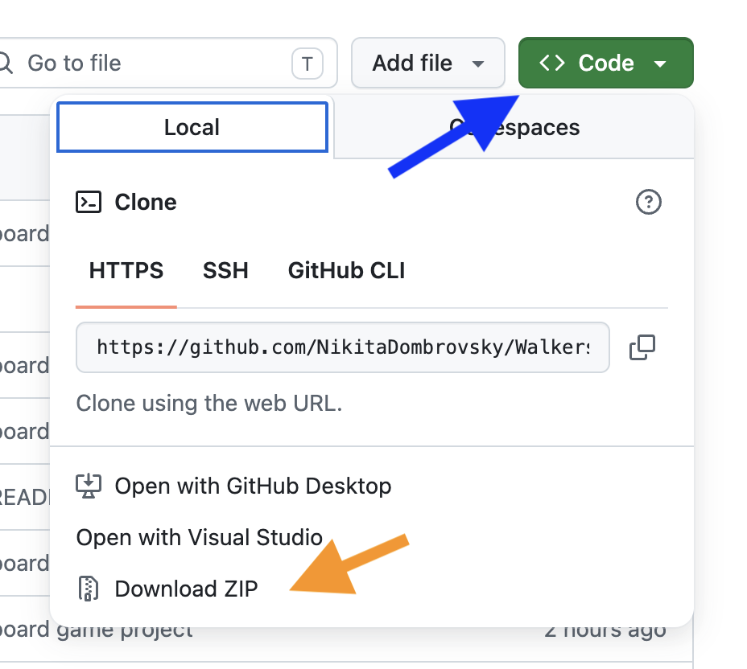
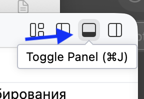
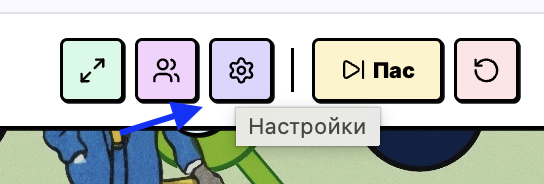
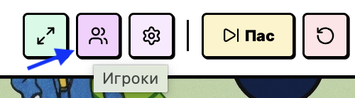

# Ходилка — Настольная игра в вашем браузере

Интерактивная игра-ходилка, воссоздающая классическую бумажную настольную игру в качественном цифровом формате. Построена на стеке **React + TypeScript + Tailwind CSS** с поддержкой плавных анимаций перемещения фишек, до 13 игроков одновременно, функцией кастомизацией правил и интерактивной викториной.


---

## 👾 Кратко

Игра в стиле Змеи и Лесницы & Своей Игры. Каждый игрок ходит с помощью кубика (клавиша `Enter`) ходят на случайное кол-во ходов. На некоторых клетках учеников ждут вопросы и интерактивные задания. Игра в достаточной мере кастомизируема: Можно самостоятельно выбрать вопросы и изменить их местоположение. 

---

## 🚀 Возможности игры

- **Интерактивная карта на 90 клеток:** Красивое игровое поле с множеством интерактивных клеток. "Телепорты" позволяют случаю повлиять на итог игры
- **До 13 игроков:** Простое управление пользователями с именами и аватарками с мемами актуальными два года назад
- **Управление:** Броски кубика делают процесс игры увлекательным, но ведущий всегда может добавить очков особо отличившимся игрокам.
- **Память:** Единый источник истины и сохраннение состояний игрока защишает от случайного обновления страницы.
- **Настройки:** 
  - Адаптивный зум игрового поля
  - Управление включением/выключением типов специальных клеток (Блиц, Вопрос, Дуэль).
  - Свободная перенастройка клеток для каждого из типов событий.
  - Настройка скорости анимации полета фишек по клеткам.
- **Интерактивные Викторины:**
  - **БЛИЦ (Желтые клетки)**: Короткие задания на ловкость и сообразительность. Верный ответ — +1 шаг вперед!
  - **ВОПРОС (Красные клетки)**: Интеллектуальный вопрос. Верный ответ — +2 шага, неверный — откат на 1 шаг назад.
  - **ДУЭЛЬ (Синие клетки)**: Вызывайте соперника на дуэль! Победитель делает рывок вперед на 2 шага.


---

## 🧑‍💻 Как установить?

1. Скачайте себе локальную версию проекта


Для этого нажмите на зеленую кнопку `Code` в GitHub и скачайте проект

2. Разархивируйте архив и откройте папку через Visual Studio Code

3. Зайдите в терминал по пути проекта



4. Установите необходимые зависимости введя команду
```bash
npm install
```

> Требуется [Node.JS](https://nodejs.org/en/download)

5. Запуск 
```bash
npm run dev
```
После запуска откройте в браузере предоставленный адрес (обычно `http://localhost:3000`).

---

## 🧠 Перед игрой 

Учитель может изменить список заданий и вопросов, выбрать подходящий пресет вопросов, поменяв номера на которых будут особые клетки.




Учитель открывает настройку `Игроки` и добавляет необходимое кол-во игроков, переименовывая их



> Аватарки подбираются автоматически из `public/assets/images/1-12.png`, в данный момент вы можете изменить их только напрямую поменяв файлы


---

## ❓ Вопросы

Если вас неустраивает первоклассная встроенная база вопросов, можете установить собственную в настройках. 

Для этого запустите игру и откройте настройки. Импортируйте .json файл с вашими вопросами, можете использовать файл `/public/questions.json` как шаблон. 

Итоговый список вопросов должен быть в формате сырого JSON, по шаблону:

```json
{
  "blitz": [
    { "id": 1, "question": "Текст вашего интерактивного задания на скорость..." }
  ],
  "question": [
    { "id": 1, "question": "Текст интеллектуального вопроса с явным ответом..." }
  ],
  "duel": [
    { "id": 1, "question": "Текст противостояния двух выбранных игроков..." }
  ]
}
```

---

## 🕹️ Как играть? 

_Учитель заранее выбирает набор вопросов в насройках соотвевующие группе, или устанавливает свои_

_Учитель запускает игру, показывая её на мониторе, объявляя начало игры, озвучивает правила_

**Учитель:** "Сейчас мы с вами поиграем в игру! Правила достаточно простые, каждый игрок в свой ход кидает кубик и двигается на соответвующее число клеток. Иногда на клетках будут попадаться специальные клетки:"

- **Телепорт:** Блоки которые перемещают вас вперед или назад. Пусть удача будет на вашей стороне!
- **ВОПРОС (Красные клетки):** Вопросы по изученному в прошедшем курсе. Верный ответ — +2 шага, неверный — откат на 1 шаг назад.
- **БЛИЦ (Желтые клетки):** Короткие задания на ловкость и сообразительность. Верный ответ — +1 шаг вперед!
- **ДУЭЛЬ (Синие клетки):** Попав на дуэль вы должны выбрать соперника. Победитель делает рывок вперед на 2 шага.

_Учитель заполняет список участников_

_Учитель начинает игру по ходам кидая кубик и комментируя выпадение, попадая на специальные зоны следит за выполнением задач или правильными ответами на вопросы_


---

## 📂 Структура проекта

```
├── README.md               # Руководство пользователя и инструкции
├── index.html              # HTML-оболочка приложения
├── vite.config.ts          # Конфигурация сборщика Vite
├── tailwind.config.ts      # Настройки Tailwind CSS стилей
├── package.json            # Скрипты запуска, сборки и внешние зависимости
├── public/                 # Статические файлы, доступные напрямую
│   ├── questions.json      # Заменяемая база вопросов для викторины
│   └── assets/
│       └── images/
│           ├── f.jpg       # Подложка винтажного игрового поля (карта)
│           └── 1-13.png    # Аватары игроков и мемы
└── src/                    # Исходный код приложения (TypeScript + React)
    ├── main.tsx            # Точка монтирования React-приложения
    ├── App.tsx             # Главный игровой модуль и интерфейсы управления
    ├── index.css           # Глобальные стили проекта с Tailwind
    ├── types.ts            # Описания строгих TypeScript-интерфейсов
    ├── coordinates.ts      # Массив 2D-координат для всех 90 игровых клеток
    ├── questionsData.ts    # Резервная встроенная база вопросов (если questions.json недоступен)
    └── components/         # Вспомогательные интерактивные модальные окна:
        ├── DiceModal.tsx        # Реалистичный кубик с физическим расположением точек
        ├── PlayersModal.tsx     # Удобная модалка добавления, настройки и выбора игроков
        ├── QuestionModal.tsx    # Карточка викторины с триггером переворота и выбором ответа
        ├── SettingsModal.tsx    # Конфигурация активных зон и скорости перемещения
        └── SpecialCellModal.tsx # Стрелочные переходы по событиям карты
```

---

## 🥴 Задачи 
- [ ] Добавить новый тип задач с настольными играми
- [ ] Собрать в .exe через Tauri или как там этот сборщик
- [ ] Заменить аватарки на более современные мемы типо скебоба черемши 
- [ ] Убрать не очень удачную иронию из README.md